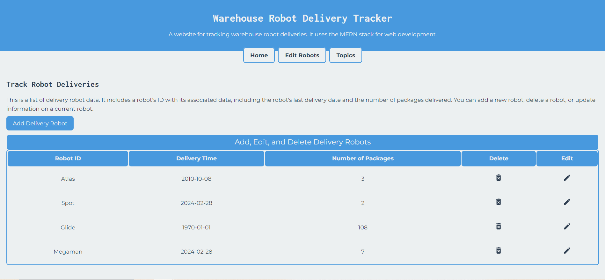

# MERN Stack Robot Management Web App

## Overview

This MERN (MongoDB, Express, React, Node.js) stack project is designed to manage robots, track delivery times, and monitor the number of packages delivered. The application allows users to **Create, Read, Update, and Delete (CRUD)** entries for robots and their associated delivery data. This project was developed to explore how data can optimize manufacturing and delivery processes.

## Motivation

I wanted to build a full stack web development project that could be useful as the data applied to the backend becomes more expansive. Data management is vital to operations that involve transporting goods. In addition, I am interested in how access to continuous updated data can be used to allow multiple autonomous systems to cooperate better. There is no end to the data that could be communicated, and the benefits it can serve to their function. This is a small prototype, though that is what I would expand it towards in the future.

## Features

- **CRUD Operations**: Add, edit, update, and delete robot records.
- **Delivery Tracking**: Manage and view delivery times and the number of packages delivered.
- **User Interface**: A responsive and intuitive frontend built with React.
- **Data Persistence**: Backend API with Express and MongoDB for data storage.

## Technologies Used

- **Frontend**: React, HTML, CSS
- **Backend**: Node.js, Express
- **Database**: MongoDB

## Screenshots

*Home Page showing the main interface*

*CRUD operations for managing robot records*

*Responsive to different screen sizes*

## Installation

    git clone https://github.com/yourusername/this-repo.git

**Navigate to Project Directory**

    cd this-repo

**Install Dependencies**

  For the backend:

    cd backend

    npm install

  For the frontend:

    cd ../frontend

    npm install

**Create a .env file in the backend directory and add your MongoDB URI:**

  MONGO_DB_URI=your_mongodb_connection_string

**Run the Application**

**Start the backend server:**

    cd backend

    npm start

**Start the frontend application:**

    cd ../frontend

    npm start

**Access the Application:**

  Open your browser and go to http://localhost:3000 to view the app.

**CRUD Operations:**

  Add Robots: Navigate to the 'Add Robot' page and enter the robot details.

  Edit Robots: Select a robot from the list and update its details.

  Update Delivery Times: Modify delivery schedules and track the number of packages.

  Delete Entries: Remove robots and delivery data as needed.
